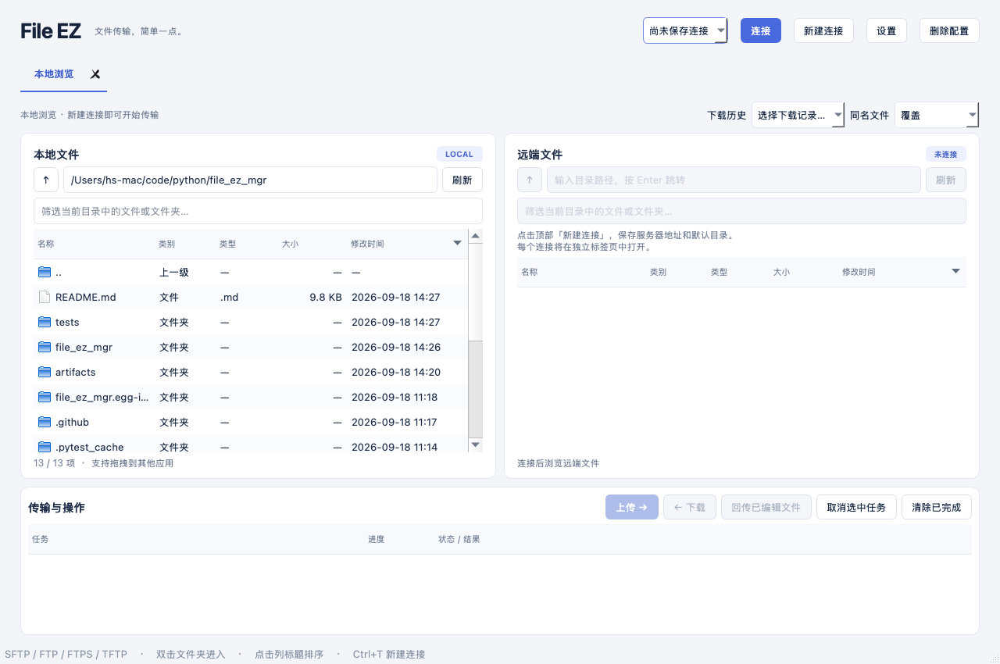

# File EZ

基于 **PyQt5** 的轻量双栏文件传输客户端，面向 **macOS、Windows、Ubuntu**。每个连接单独占用一个标签页，分别维护本地目录、远端目录和后台任务队列。



## 启动

需要 Python **3.10+**，建议使用 Python 3.11–3.13 和独立虚拟环境。

macOS / Ubuntu：

```bash
python3 -m venv .venv
source .venv/bin/activate
python -m pip install -e .
python -m file_ez_mgr
```

Windows PowerShell（无需修改脚本执行策略）：

```powershell
py -3 -m venv .venv
.\.venv\Scripts\python.exe -m pip install -e .
.\.venv\Scripts\python.exe -m file_ez_mgr
```

也可使用 `python main.py` 或安装后的 `file-ez` 命令启动。

Ubuntu 必须在桌面会话运行。若启动提示 Qt xcb 插件缺少系统库，可安装：

```bash
sudo apt-get update
sudo apt-get install libxcb-xinerama0 libxcb-cursor0 libxkbcommon-x11-0 libegl1 libopengl0
```

## 使用

1. 点击 **新建连接**，选择协议，填写地址、端口、用户名和默认本地 / 远端目录，然后保存。
2. SFTP 已填写 SSH 私钥时，密码 / 私钥口令可留空，首次连接和重新连接均直接尝试使用私钥，不再弹窗询问。加密私钥若需要口令，请在连接设置中填写。
3. 在顶部选择已保存的配置，点击 **连接**；多次打开不同配置或同一配置均会建立独立标签页。
4. SFTP 首次连接显示服务器 SHA256 主机指纹，核对后可保存信任；已知密钥变化时拒绝连接。
5. 左右两栏均可双击文件夹和 `..`，或在地址栏输入目录后按 Enter。Windows 可直接输入 `D:\` 切换磁盘。本地和远端地址栏均支持 `~`、`~/子目录`；本地指当前系统用户主目录，SFTP / FTP / FTPS 远端指登录后的初始目录，不受当前浏览目录影响。远端默认目录也支持上述写法。
6. 点击 **名称 / 类别 / 类型 / 大小 / 修改时间** 列标题升降序排序。默认按修改时间降序排列，最新项目在前；`..` 始终置顶。大小按实际字节数排序。
7. 多选文件或文件夹后点击 **上传 / 下载**，或从左栏拖到右栏上传到右栏当前目录。支持递归目录、空文件夹和空文件。单个连接内操作串行，不同标签页可并行传输。
8. 右键支持传输、新建文件夹、编辑和删除；删除含二次确认，属于永久删除，不经过回收站。
9. 远端普通文件右键 **编辑** 可在内置编辑器中修改，点击 **保存到远端** 或使用系统保存快捷键直接写回，无需手动回传。支持 8 MB 以内的 UTF-8 文本，保留 UTF-8 BOM 和 CRLF 换行；保存失败保留编辑内容，关闭未保存文件时询问是否放弃。保存前检查远端内容是否变化，若变化则阻止覆盖并提示重新打开后合并（检查与写入并非服务端事务）。
10. 本地文件可由默认应用打开。原有 **编辑（下载后打开）** 会先将远端文件下载到临时目录再由默认应用打开，编辑器保存后点击 **回传已编辑文件**，选择文件后直接覆盖远端文件。该外部应用编辑流程不会自动回传，关闭标签前应完成回传。
11. 同名文件默认 **覆盖**，上传、下载及编辑回传均直接覆盖，不弹出覆盖确认；也可手动选择 **跳过**。目录会合并，文件和目录同名时停止并报告错误。
12. 任务列表展示结果、错误和当前文件的传输百分比。选中任务可取消，网络阻塞时会在 I/O 返回或超时后生效。

### 恢复上次窗口

退出时自动保存打开的标签页、排列顺序、当前选中的页面和各标签的本地 / 远端目录；下次启动直接回到上次页面。关闭窗口和通过应用菜单退出均会保存，取消关闭则不更新记录。首次启动或没有可恢复的标签页时才打开“本地浏览”。

窗口记录保存在配置目录的 `workspace.json`，不保存密码或传输队列。使用 SSH 私钥的 SFTP 连接会自动尝试重连；需要密码的连接保留页面，点击“重新连接”后输入凭据。已删除的连接会跳过，本地目录不存在时回退到用户目录。

### 下载历史

“同名文件”左侧的 **下载历史** 下拉框记录成功下载的项目，每个连接保留最近 50 条，相同项目再次下载会移到最前。文件夹记录下载后文件夹本身的本地 / 远端路径；单文件记录其两侧所在目录。选择记录即跳转两侧视图，并清空当前文件名筛选。

历史独立保存在配置目录的 `download-history/` 中，重启后自动读取。同一连接的多个标签页展开下拉框时会读取最新记录；不同连接及不同服务器 / 用户之间隔离。失败、取消以及全部跳过的下载不新增历史；记录不存在或目录无法访问时提示错误。TFTP 无目录浏览能力，不提供双栏历史跳转。

### 拖拽到微信、飞书等应用

从**本地文件列表**拖拽一个或多个文件 / 文件夹到其他应用；也可从**远端文件列表**选择一个或多个普通文件拖到微信、飞书等窗口。文件以本地文件形式交给目标应用，拖拽仅复制，不移动远端原文件。

远端文件会先在后台下载，任务列表显示进度并支持取消。准备完成时，如果仍按住鼠标左键会进入拖拽；如果已经松开鼠标，看到“拖出文件已准备好”后再拖一次。准备失败或取消时不会交付未完成的文件。远端文件夹和符号链接暂不支持拖出。

拖出副本保存在配置目录的 `drag-cache/` 中，关闭标签页和退出程序后仍保留，方便目标应用继续读取。目标应用发送完成后可手动清理该目录。成功拖出后再次拖拽会重新下载。文件是否被接受取决于目标应用；微信 / 飞书实际接收及各系统桌面交互仍需在对应环境验收。

### 连接保活与自动恢复

SFTP 保留 SSH 底层保活，同时与 FTP / FTPS 一样，每 30 秒在空闲时进行一次连接探测。探测与文件操作共用串行队列，传输过程中不会插入心跳。

每次远端操作前检查连接，发现断线时使用本次会话内的凭据自动重连，然后继续原操作。读取目录、下载、打开远端编辑器和准备拖出文件如果中途遇到连接错误，重连后最多重试一次；上传、保存、删除和新建文件夹中途失败时不自动重复执行。网络暂不可用时，后台每 30 秒继续尝试，状态栏显示结果；密码错误或服务器主机密钥变化仍需手动处理，不会跳过验证。密码不写入磁盘，重启软件后的凭据规则不变。

## 协议能力

| 协议 | 浏览目录 | 文件夹传输 | 删除 / 编辑回传 | 说明 |
| --- | --- | --- | --- | --- |
| SSH / SFTP | 是 | 是 | 是 | SSH 的 SFTP 子系统，密码、私钥、SSH Agent |
| FTP | 是 | 是 | 是 | 支持主动 / 被动模式；目录列表要求服务端支持 MLSD |
| FTPS | 是 | 是 | 是 | 显式 TLS，验证系统信任的服务器证书；非隐式 FTPS |
| TFTP | 否 | 否 | 否 | 指定远端文件路径上传 / 下载单个文件，无登录握手 |

TFTP 协议不具备目录列表和删除功能，不模拟虚假的目录树。界面显示“待传输验证”，实际传输时才验证服务器可达性。TFTP 不能查询文件是否存在，因此上传同名文件的行为由服务端决定，不能提供 FTP/SFTP 的跳过或临时文件替换保证。

FTP 为明文协议；SFTP 和 FTPS 提供加密传输。FTP 的 MLSD 扩展在常见服务器中可用，旧服务器不支持时会明确报错。SFTP 覆盖使用服务端 `posix-rename` 扩展；若不支持，则保留原文件并报错。FTP 覆盖依赖服务端的 RNFR/RNTO 实现，禁止替换的服务器会报错。

## 配置与文件处理

- 配置自动保存、启动读取，使用 Qt `AppConfigLocation`，具体文件位置会在保存后的状态栏显示。
- 默认位置通常为：
  - macOS：`~/Library/Preferences/FileEZ/FileEZ/connections.json`
  - Windows：`%LOCALAPPDATA%\FileEZ\FileEZ\connections.json`
  - Ubuntu：`~/.config/FileEZ/FileEZ/connections.json`
- 保存连接名称、协议、主机、端口、用户名、私钥路径、默认目录和 FTP 模式；**密码 / 私钥口令仅保留在内存，不写入 JSON**。
- SSH 信任记录在同目录 `known_hosts`，同时读取系统用户的 SSH known_hosts。
- JSON 原子替换写入；配置损坏时保留原文件并禁止覆盖保存，修复后重启。
- SFTP/FTP 上传先写远端随机 `.part` 文件，成功后重命名；下载先写本地临时文件，成功后替换。失败 / 取消时尽力清理临时文件，连接丢失时可能需手动清理服务端残留。
- 上传 / 下载遇到源符号链接时跳过该项并继续其他文件，包括失效链接和循环链接；不跟随、不复制链接目标。任务结果显示跳过的链接数量，悬停在结果列可查看完整路径。目标位置是符号链接时仍停止该任务，避免覆盖链接指向的文件。FTP 的链接识别取决于服务器 MLSD 返回的信息。
- 拒绝目录穿越、控制字符、Windows 非法名称等不安全目标路径。
- 暂未实现断点续传、文件夹总体字节进度、自动同步、本地复制移动和操作系统钥匙串保存密码。

### 上传 Python 项目到其他系统

例如 macOS 项目的 `.venv/bin/python` 通常是符号链接。上传整个项目时这类链接会跳过，其他文件继续传输；已上传的文件不会回滚。修复版本重启后可以重新上传，选择“跳过”模式可保留已存在的同名文件并继续处理剩余内容；默认“覆盖”模式会直接重新写入同名文件。

macOS 的 `.venv` 不能直接作为 Ubuntu 的运行环境，即使其中普通文件上传成功，也需要在 Ubuntu 上单独创建 Linux 虚拟环境并安装依赖。程序不会自动排除整个 `.venv` 目录。

## 测试

```bash
python -m pip install -e '.[dev]'
python -m pytest -q -W error
```

测试在临时目录启动 loopback FTP、SFTP、TFTP 服务，不需要外部服务器。覆盖真实往返传输、递归目录、中文路径、空文件夹、覆盖、取消后 FTP 重连、SSH 首次信任和主机密钥变化拒绝，以及 Qt 界面连接 / 传输 / 编辑下载流程、排序、拖拽 MIME、配置持久化与失败清理。

仓库附带 `.github/workflows/test.yml`，在 Windows / Ubuntu / macOS 与 Python 3.11 / 3.13 矩阵运行。当前本地验证环境为 Apple Silicon macOS / Python 3.13；Windows、Ubuntu 与真实 FTPS 服务的验收仍需在对应环境执行，不能将 CI 配置等同于已通过验证。

## 打包

在**各目标操作系统分别**构建，PyInstaller 不跨系统生成安装包：

```bash
python -m pip install -e '.[dev]'
python -m PyInstaller --noconfirm --windowed --name FileEZ --collect-all tftpy main.py
```

输出在 `dist/`：Windows 为 `FileEZ/FileEZ.exe`，macOS 为 `FileEZ.app`，Ubuntu 为 `FileEZ/FileEZ`。对外发布仍需按各系统要求签名 / 公证；打包产物不包含用户配置和密码。

## 结构

```text
file_ez_mgr/
  app.py         主窗口、连接配置管理、多标签页、样式
  session.py     双栏文件管理、操作菜单、编辑回传、任务交互
  widgets.py     排序文件视图、原生跨应用拖拽
  editor.py      内置远端文本编辑器、保存与未保存修改保护
  dialogs.py     连接设置表单
  config.py      数据模型、JSON 原子读写
  history.py     按连接保存下载历史、去重与数量限制
  backends.py    SFTP / FTP / FTPS / TFTP 后端
  transfers.py   递归传输、冲突处理、临时文件、删除
  workers.py     每个会话的串行后台队列与取消
```

协议参考：[Paramiko SSHClient](https://docs.paramiko.org/en/stable/api/client.html)、[Qt QMimeData](https://doc.qt.io/qt-6/qmimedata.html)、[TFTP RFC 1350](https://www.rfc-editor.org/rfc/rfc1350.html)。
